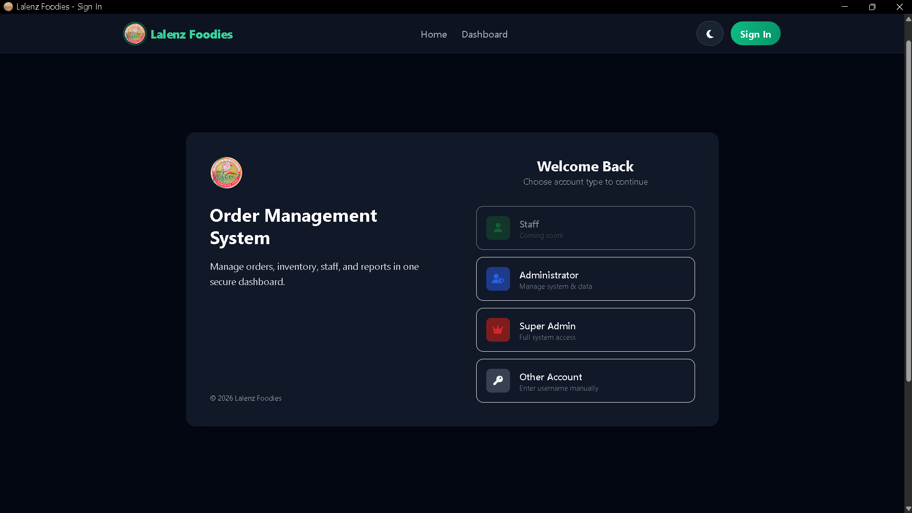
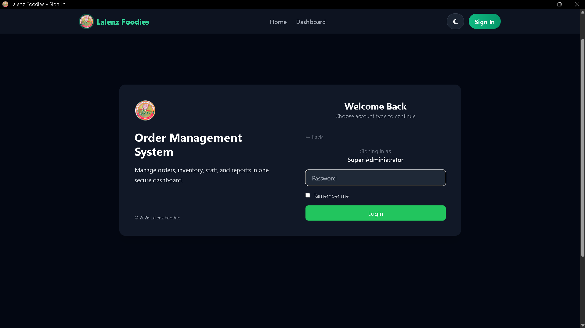
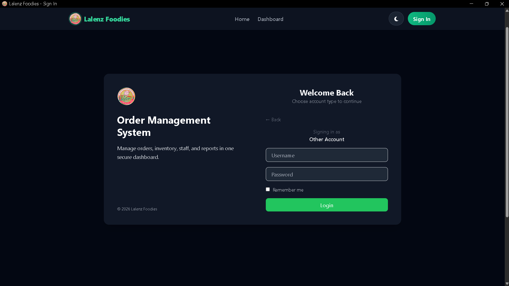

# 🍽️ Lalenz Order Management System

> A modern restaurant order management system built to simplify order tracking, sales monitoring, and daily restaurant operations.

  
  
  
  
  

---

## 📖 About

**Lalenz Order Management System** is a web-based restaurant management application designed to make order tracking and daily operations easier.

The system provides an administrative dashboard where restaurant staff can monitor sales, orders, pending transactions, completed orders, recent activity, and overall performance from a single interface.

The project combines a responsive frontend with PHP backend functionality, dynamic data processing, authentication, database integration, and interactive analytics.

---

## ✨ Features

### 📊 Dashboard

- Today's sales
- Orders today
- Pending orders
- Completed orders
- Sales comparison with yesterday
- Order comparison with yesterday
- Recent orders
- Dynamic currency formatting

### 📦 Order Management

Recent orders provide important information at a glance:

- Customer name
- Order ID
- Number of items
- Order total
- Order status
- Order date and time

### 📈 Performance Analytics

Interactive charts powered by **Chart.js**.

Supported ranges:

- Last 24 Hours
- Last 7 Days
- Last 15 Days
- Last 30 Days
- Last 60 Days
- Last 12 Months

The dashboard visualizes both **order volume** and **sales revenue**.

### 🌙 Dark Mode

The application supports light and dark themes using Tailwind CSS.

The selected theme is stored in `localStorage` so the user's preference persists between visits.

### 💱 Currency Support

Sales values are dynamically formatted using the configured currency and currency symbol.

### 🌎 Timezone Support

Dashboard statistics and order timestamps use the configured system timezone.

This keeps daily statistics, yesterday comparisons, chart data, and order timestamps consistent.

### 🔐 Authentication

Administrative functionality supports authentication and protected dashboard access.

JWT can be used for authentication and API authorization.

---

## 🛠️ Tech Stack

### Frontend

- HTML5
- CSS3
- JavaScript
- jQuery
- Tailwind CSS
- Bootstrap
- Chart.js
- Font Awesome
- Toastr.js

### Backend

- PHP
- Node.js
- Express.js
- REST APIs
- JWT

### Database

- MongoDB
- SQLite

---

## 🖥️ Dashboard

The dashboard focuses on presenting the most important restaurant information immediately after login.

### Key Metrics

| Metric | Description |
| --- | --- |
| 💰 Today's Sales | Total non-cancelled sales for today |
| 🛒 Orders Today | Number of valid orders today |
| ⏳ Pending | Orders currently waiting to be processed |
| ✅ Completed | Completed orders today |

### Performance Overview

The dashboard includes a dual-axis chart displaying:

- **Orders** — number of orders over time
- **Sales** — total sales over time

---

## 📋 Order Statuses

The system supports multiple order states:

- 🟠 **Pending**
- 🟡 **Preparing**
- 🟢 **Ready**
- 🔵 **Out For Delivery**
- 🟣 **Scheduled**
- 🟢 **Completed**
- 🔴 **Cancelled**

Cancelled orders are excluded from sales calculations.

---

## 📁 Project Structure

    LALENZ_ORDER_SYSTEM/
    │
    ├── Pages/
    │   ├── admin/
    │   │   ├── login.php
    │   │   └── dashboard.php
    │   │
    │   ├── Partials/
    │   │   ├── navbar.html
    │   │   └── footer.php
    │   │
    │   └── Script/
    │       ├── init.php
    │       ├── get_orders.php
    │       └── Dashboard/
    │           └── navbar.js
    │
    ├── assets/
    │   └── ...
    │
    ├── index.php
    └── README.md

---

## 🎨 UI & UX

The interface was designed around a clean and modern dashboard experience.

### Highlights

- Responsive design
- Mobile-friendly layout
- Light and dark themes
- Smooth transitions
- Rounded dashboard cards
- Color-coded order statuses
- Interactive analytics
- Toast notifications
- Dynamic content loading
- Responsive navigation

---

## 📸 Screenshots

Add your screenshots inside a `screenshots` directory.

### Dashboard

### Dark Mode

### Login

---

## 🔄 Application Flow

    Admin
      │
      ▼
    Login
      │
      ▼
    Authentication
      │
      ▼
    Dashboard
      │
      ├── Sales
      ├── Orders
      ├── Pending
      ├── Completed
      └── Analytics
              │
              ▼
          Order Data
              │
              ▼
           Database

---

## 🧠 What I Learned

Building Lalenz gave me practical experience with multiple technologies working together in a real application.

I worked with:

- PHP backend development
- JavaScript
- jQuery AJAX
- REST APIs
- JWT authentication
- Node.js
- Express.js
- MongoDB
- SQLite
- Tailwind CSS
- Bootstrap
- Chart.js
- Responsive UI development
- Dark mode
- Date and timezone handling
- Dynamic data processing
- Dashboard architecture

More importantly, this project helped me understand how different technologies can work together to build a complete, database-driven application.

---

## 🚀 Roadmap

- [ ] Real-time order notifications
- [ ] Customer management
- [ ] Menu management
- [ ] Inventory management
- [ ] Advanced sales reports
- [ ] PDF / Excel exports
- [ ] Role-based access control
- [ ] Automated backups
- [ ] Advanced analytics
- [ ] Mobile / PWA support
- [ ] Improved REST API architecture

---

## 👨‍💻 About Me

I'm a **22-year-old developer** interested in web development, backend systems, REST APIs, databases, and building practical applications.

I'm still learning and experimenting with different technologies, using real projects like Lalenz to improve my development skills.

### Technologies I've Worked With

**Languages & Runtime**

`JavaScript` `PHP` `Node.js`

**Backend**

`Express.js` `REST APIs` `JWT`

**Frontend**

`Tailwind CSS` `Bootstrap` `jQuery`

**Database**

`MongoDB` `SQLite`

---

## 📌 Project Status

**Active Development**

Lalenz is an ongoing project. New features, improvements, and optimizations will continue to be added as the project evolves.

---

  Built with ❤️ and a lot of debugging.

